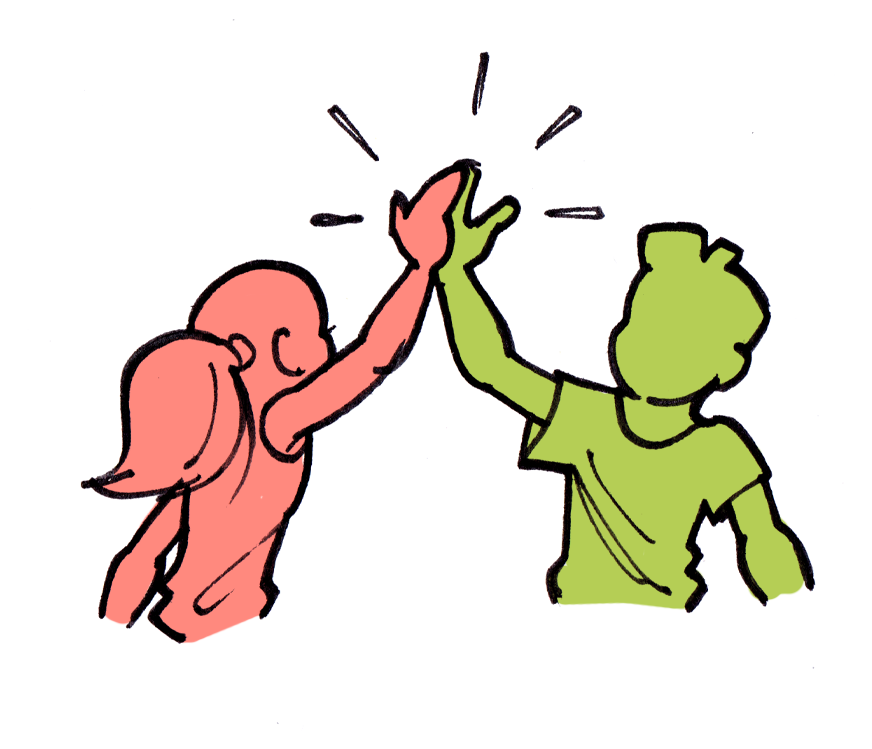

[Home](../index.md) / [Welcome](./index.md)

# Agreements

## Summary

1. [Vocabulary](./agreements.md#vocabulary) 
0. [Member](./agreements.md#member) 
0. [Alliance](./agreements.md#alliance) 

## Vocabulary

**Member**: a player in our alliance  
**Player**: any player in the game  
**R5**: leader of the alliance  
**R4**: right-hand persons of the leader  

## Member

### General rules

1. The member has a good behavior (polite, no insult against another player, no harasment, listening to instructions, ...)
0. The member reads the alliance chat (at least @All or member tagged messages)
0. The member reads and anwsers to direct messages
0. The member is not allowed to attack a city of a member from another alliance
0. Except during some events, the member is not allowed to attack tiles of a member from another alliance
0. In any case, the member does not do anything that could hurt another member
0. The member ensures to read the instructions for each event
0. In any doubt, ask to R4/R5 before doing anything

(something to add about alliance events and voting system to ensure people to respect the schedule)

### Ranking

The member of the alliance is promoted or demoted depending the following actions:
- General behavior
- Contribution to alliance
    - Fighting for facilities, fortresses and strongholds
    - Participating to allliance events
    - Helping other members
- Continuously making mistakes
- (In)activity

#### R3
- Very active member
- Very good knowledge of heroes usage
- Good knowledge of what to do during already played events

#### R2
- Active member
- Keep learning

#### R1
- Inactive member
- Make too many mistakes (even after explanations)

### Exclusion

Breaking the rules can lead the member to be excluded from the alliance.

## Alliance 

1. The alliance ensure each member's protection
0. The alliance shares equally rewards between their members
0. The alliance helps, teaches, gives instructions to members to grow