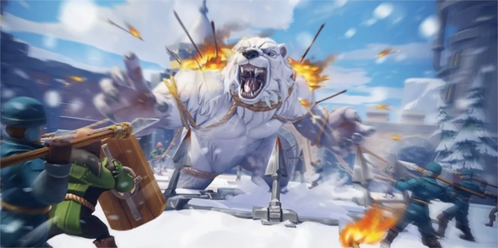
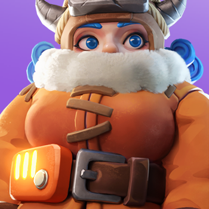

[Home](../../index.md) / [Welcome](../index.md)

# Bear trap

## Instructions

### Rally leader

1. Rally leader should be in the **3 first rings** around the bear trap
0. Only if there are not enough rallies, or for last call, other member can open new rallies
0. Use the strongest heries with the most **attack/damage** skills

### Rally joiner

1. Use as leader a hero with **attack** or **damage** skill (top right)

    | Image | Name |
    | ---  | --- |
    |  | Jeronimo |
    |  | Jessie |
    |  | Jasser |
    |  | Seo yoon |
    |  | Philly |

    Fill the 2nd and 3rd heroes with any
0. If you don't have any of them, send troops **WITHOUT** any hero
