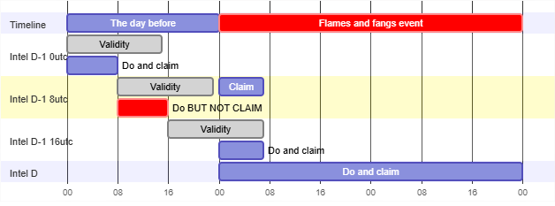
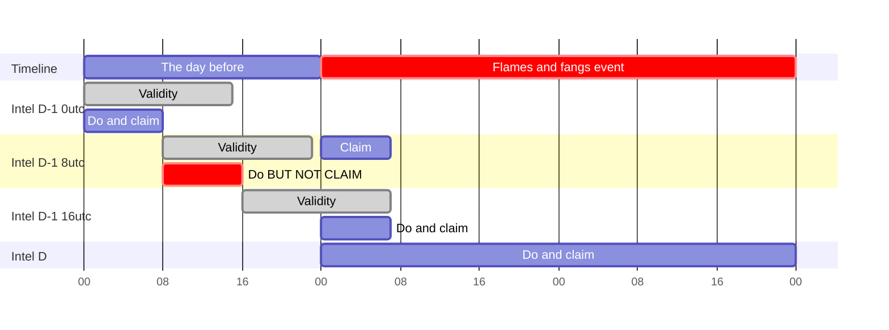

[Home](../../index.md) / [Welcome](../index.md)

# Flames and fangs

## Instructions

To maximize rewards, it's important to follow this timeline the day beofre the event

### Mermaid diagram

```mermaid
---
displayMode: compact
---
gantt
    dateFormat  YYYY-MM-DD
    tickInterval 8hour
    axisFormat  %H

    section Timeline
    The day before          :a1, 2000-01-01, 1d
    Flames and fangs event  :crit,a2, 2000-01-02, 2d

    section Intel D-1 0utc
    Validity        :done,b1, 2000-01-01, 15h
    Do and claim    :b2, 2000-01-01, 8h

    section Intel D-1 8utc
    Validity            :done,c1, 2000-01-01 08:00:00, 15h
    Do BUT NOT CLAIM    :crit, c2, 2000-01-01 08:00:00, 8h
    Claim               :c3, 2000-01-02 00:00:00, 7h

    section Intel D-1 16utc
    Validity        :done,d1, 2000-01-01 16:00:00, 15h
    Do and claim    :d2, 2000-01-02 00:00:00, 7h

    section Intel D 
    Do and claim   :e1, 2000-01-02 00:00:00, 2d
```